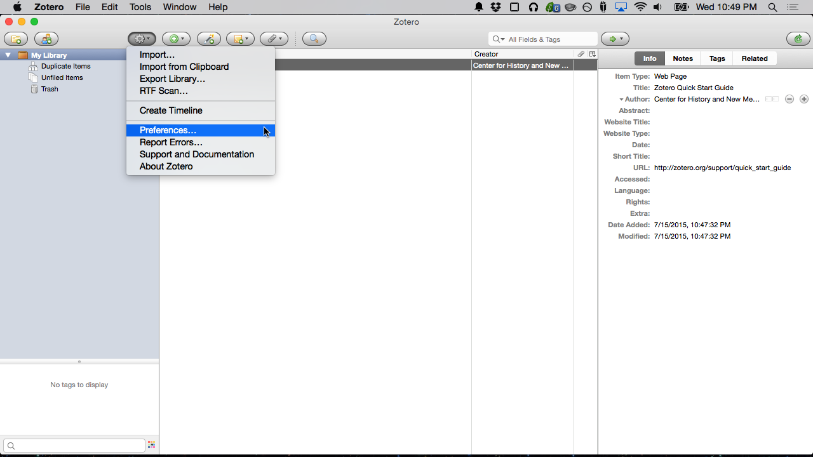
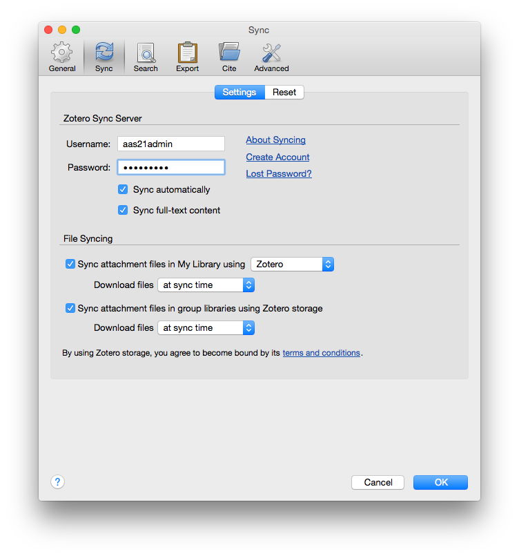
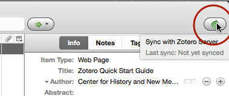
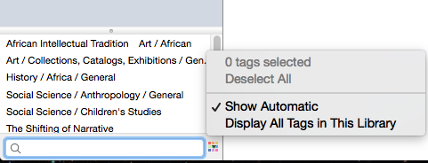
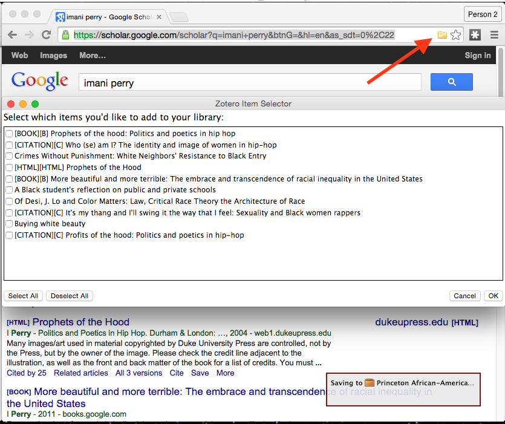
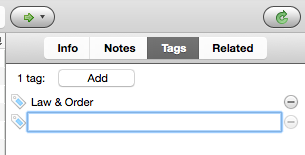
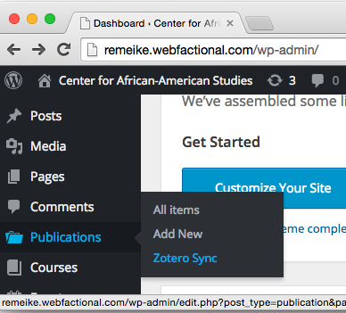

Zotero exists as both a desktop app, a Firefox extension, and a web-based interface. I suggest [Zotero Standalone](https://www.zotero.org/download/); you will have the best results by installing a browser extension as well (available for Chrome, Firefox, and Safari on the same page).

## Installation

To start, download and install the desktop app from the link above. You can ignore the Word/OpenOffice integration, as that is not needed.

### Configuration

Click on the gear icon and select Preferences.

Move to the Sync tab and enter the credentials from the e-mail.

Hit the sync button (the circular green arrow) at the top right of the main Zotero toolbar.

In a moment, a new item should appear in the left pane called "Group Libraries." Click the disclosure triangle beside "Group Libraries" and select "Faculty Work" under "Princeton African-American Studies."

At the bottom of the left side, you will see a set of tags associated with the document collection. These will link texts with the different Research Areas found on the site. A number of tags are added automatically in the import process, but you can limit this to the user-specified tags by deselecting "Show Automatic" from the small color-palette-esque menu.

That completes the basic configuration.

## Workflow

With the app installed and ready, the workflow proceeds as follows:

1. (In the browser): Search for a faculty member on [Google Scholar](http://scholar.google.com)
2. (Browser): Import citations en masse using the folder icon, visible at top left
3. (Zotero): Add tags to the text corresponding to the research areas covered by the text

For example, say we wanted to import the work of Imani Perry. From the Google Scholar results, we can click the folder icon at top right to import several citations at once.

### Import Citations

Note that the results may have some repetition, but these items can be omitted from the selection (or merged later). Click OK and the items will be saved to the Zotero library. (Don't worry if the "Saving" dialog lingers, just check the Zotero window to confirm that the citations have been added.

### Tagging Research Areas
To add the Research Area to a text, first highlight the text in the library:

Then, click on the "Tags" tab atop the right-hand pane, click "Add," and start typing (for example, "L" will auto-complete to "Law & Order." Click somewhere outside the text box or press tab to finalize the tag (or to add another if you wish).

## WordPress Integration

Once a number of citations have been added and tagged appropriately, they can readily be brought into WordPress. Go to the Publications item in the admin toolbar and select "Zotero Sync."

Then click "Sync Now." After a moment, the sync will be complete and the publications will appear in the standard locations (faculty pages, research areas, and the collective archive of published works).

If the new citations don't seem to appear, make sure you have added them to the "Faculty Work" folder in Zotero, not the general group library. (To double-check, select the general "Princeton African-American Studies" group library and drag them to the folder; if they're already in the folder, it won't let you do so.)